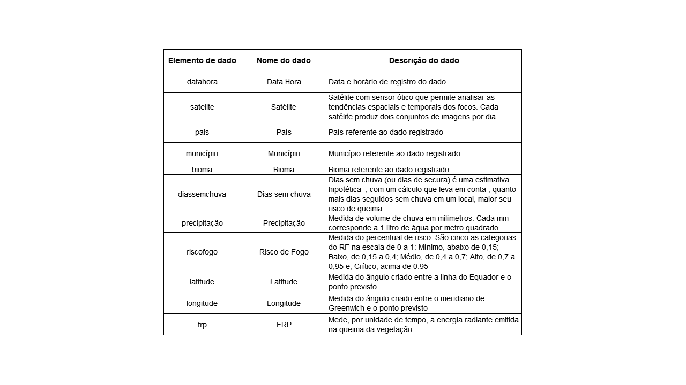

[](https://s2.glbimg.com/RzKBN3O6Fh5QjqA4x0mQDiW4is4=/0x0:2000x1333/984x0/smart/filters:strip_icc()/i.s3.glbimg.com/v1/AUTH_59edd422c0c84a879bd37670ae4f538a/internal_photos/bs/2019/r/P/hrPwKtTZCMAZYIQ33EyQ/age20190828130.jpg)


```{r setup, echo = FALSE, warning = FALSE, include = FALSE, warnings=FALSE}
knitr::opts_chunk$set(echo = TRUE, warning = FALSE, fig.align = "center")

library(stats)
library(caret)
library(mlbench)
library(gtsummary)
library(MASS)
library(ROCR)
library(prediction)
library(data.table)
library(purrr)
library(car)
library(mice)
library(gains)
library(pROC)
library(ROCR)
library(ROSE)
library(e1071)
library(psych)
library(randomForest)
library(tree)
library(knitr)
library(MASS)
library(corrplot)
#install.packages("devtools")
devtools::install_github("tidyverse/tidyverse")
library(tidyverse)
library(randomForest)
library(tree)
library(dplyr)
library(knitr)
library(markdown)
library(ggplot2)
```

## 
Aplicação de modelos de machine learning para prever o risco de queimadas e de incêndios no Brasil

Análise Exploratória de Dados sobre Queimadas

Experimento, em ciência de dados, para prever o risco de queimadas e de incêndios no Brasil

Entendimento (Insights) sobre o risco de queimadas e de incêndios no Brasil a partir da aplicação de modelos de aprendizado de máquina (Machine Learning)

Experimento de aplicação de modelos de machine learning em base de dados do Programa Queimadas / Inpe para entendimento sobre o risco de fogo no Brasil

## **Sumário**
<div style="text-align: justify">

Introdução<div>
2. Descrição das variáveis<div>
3. Análise Exploratória dos dados<div>
    -Aplicando Imputação em Valores Missing Usando Método PMM (Predictive Mean Matching)<div>
    -Treinamento do modelo de regressão linear n1<div>
    -Treinamento do modelo de regressão linear n2<div>
    -Treinamento do modelo de regressão linear n3<div>
    -Treinamento do modelo de regressão linear n4<div>


<div/>

## **Introdução**

<div style="text-align: justify"> 

Em meados de 2021, quando teve início a segunda temporada do [Programa de Mentoria entre Alunos da DSA](https://blog.dsacademy.com.br/programa-de-mentoria-entre-os-alunos-dsa-temporada-2021/), a imprensa destacava a  [liderança do Brasil](https://www.climatempo.com.br/noticia/2021/06/02/brasil-lidera-o-ranking-de-queimadas-da-america-do-sul-0141) no ranking de queimadas da América do Sul e a crescente propagação de incêndios em [áreas florestais pelo mundo](https://www.cnnbrasil.com.br/internacional/incendios-florestais-se-espalham-pelo-mundo-e-atingem-novas-regioes/). A escolha do **tema** deste projeto foi reforçada pelo registro, em 2020, se considerada a década que se encerrava, de recorde brasileiro do número de queimadas: [222.797 focos](https://queimadas.dgi.inpe.br/queimadas/portal-static/estatisticas_paises/).

Pesquisa do [MapBiomas](https://mapbiomas-br-site.s3.amazonaws.com/Fact_Sheet.pdf) revela que os incêndios já afetaram - contribuindo para o risco de extinção - 85% das espécies e dos animais na Amazônia. Todos os anos, o Brasil queima uma [área superior](https://mapbiomas.org/a-cada-ano-brasil-queima-area-maior-que-a-inglaterra) à Inglaterra. Além disso, nos últimos 36 anos, 85% da área queimada estavam na Amazônia e no Cerrado. O país ainda está entre as dez primeiras posições no [ranking dos países](https://www.climatewatchdata.org/countries/CHN) com maior emissão de gases do efeito estufa. Face aos alertas de especialistas e ambientalistas acerca dos impactos já verificados no clima e na biodiversidade, **um campo propício à aplicação de ferramentas de ciência de dados e de machine learning** foi identificado ao ser vislumbrada a tendência de aumento das queimadas e dos incêndios, seja [em escala, seja em emissão de CO2.](https://www.climatewatchdata.org/countries/CHN)

A **hipótese** de trabalho lançada baseia-se no pressuposto de que [indicadores de degradação ambiental](http://marte.sid.inpe.br/col/dpi.inpe.br/sbsr@80/2006/10.31.19.48/doc/2745-2752.pdf) podem auxiliar na criação de [políticas](http://marte.sid.inpe.br/col/dpi.inpe.br/sbsr@80/2006/10.31.19.48/doc/2745-2752.pdf) balizadas pelo [princípio do desenvolvimento econômico sustentável.](https://www.senado.leg.br/atividade/const/con1988/con1988_05.10.1988/art_170_.asp) Acredita-se que, por seu potencial de subsídio para análises geoeconômicas (portanto, ligados a aspectos geográficos e a aspectos socioeconômicos), esses instrumentos de avaliação e de monitoramento podem gerar insights para a elaboração de ações de proteção ao meio ambiente.

Entre as plataformas mapeadas de dados abertos ligados ao meio ambiente, optou-se pela [Programa Queimadas](https://queimadas.dgi.inpe.br/queimadas/portal-static/estatisticas_paises/), **portal de monitoramento** de focos de incêndio e queimadas disponibilizado pelo [Instituto Nacional de Pesquisas Espaciais (Inpe)](https://queimadas.dgi.inpe.br/queimadas/portal-static/estatisticas_paises/). A partir da [API](https://queimadas.dgi.inpe.br/queimadas/dados-abertos/) disponível no portal, foi construído um [fluxo de trabalho](https://github.com/dsa2021/dsa2021.github.io/blob/main/.github/workflows/main.yml) automatizado que, implementado em duas etapas, permitiu a geração da [base de dados amostral](https://github.com/dsa2021/dsa2021.github.io/blob/main/data/Focos_2021-06-26_2021-06-27.csv) utilizada nos experimentos propostos:


 - **ETAPA 1: EXTRAÇÃO diária**, em dois horários (06:00 e 18:00), de dados da web.
 - **ETAPA 2: ATUALIZAÇÃO** do [diretório](https://github.com/dsa2021/dsa2021.github.io/tree/main/data), salvando os dados capturados em arquivo.csv.

O projeto foi disponibilizado no diretório [dsa2021](https://github.com/dsa2021/dsa2021.github.io/tree/main/data) da plataforma Github que, além da vantagem da gratuidade para o armazenamento, possibilitou a implementação de fluxo de trabalho colaborativo integrado ao sistema de versionamento Git. Foi considerada ainda a facilidade de apresentação, para acesso público, dos resultados ao final do projeto.

A análise exploratória da base de dados amostral levou, a princípio, à investigação da natureza técnica de duas variáveis - **riscofogo**.

O homem usa o fogo desde o início da era agrícola, como forma de limpar o terreno e preparar o plantio. A queima incorpora ao solo, nutrientes contidos na vegetação nativa e favorece o desenvolvimento de novas culturas.

Mas o material proveniente da queima da vegetação, deve ser prontamente incorporado ao solo para não haver perdas e erosão por conta das chuvas.

O fogo pode acontecer por causas naturais como raios ou pela ação do homem. O fogo controlado e em áreas delimitadas ainda é usado como forma de manejo em diversas culturas.

Quando o fogo acontece de maneira descontrolada, os chamados incêndios florestais, este causa grandes impactos negativos como a destruição da floresta, morte de animais silvestres, aumento da poluição do ar, prejuízos à saúde, aumento de gases de efeito estufa, entre outros.

Temos acompanhado a ocorrência de vários focos de incêndio, ocorrendo em biomas como o Cerrado e a Amazônia.

Esse estudo tenta prever através do uso de aprendizado de máquina, analisando variáveis, o Risco Fogo.

A **frp** (Energia Radiativa do Fogo) – ao sugerir que elas poderiam ter papel central na estimação e na compreensão da natureza do fenômeno estudado. [Relativa ao Risco de Fogo ou Risco de Fogo Meteorológico, a primeira está associada ao cálculo, sob a perspectiva meteorológica](https://queimadas.dgi.inpe.br/queimadas/fip-risco/), da suscetibilidade da vegetação para a queimada e para o incêndio. O cálculo do Risco de Fogo está ligado a outras variáveis ambientais, como a precipitação, a temperatura e a umidade relativa do ar.

Já a [Energia Radiativa do Fogo (FRP)](https://ainfo.cnptia.embrapa.br/digital/bitstream/item/35642/1/2010-o-uso-de-produtos-operacionais-de-sensoriamento-remoto-para-a-analise-ambiental-na-America-do-Sul.pdf) mede, por unidade de tempo, a energia radiante emitida na queima da vegetação. A estimativa do total de biomassa queimada é feita integrando a dimensão temporal da FRP à Energia Radiativa do Fogo (FRE, do inglês Fire Radiative Energy). Esta representa a radiação eletromagnética transmitida pelo fogo, durante o ciclo de vida da queimada.

O indício da importância do Risco de Fogo – associado à Energia Radiativa do Fogo – levou à formulação da **pergunta-problema** e à definição do **objetivo** que nortearam os experimentos.

 - **PERGUNTA-PROBLEMA**: Como os resultados obtidos nos experimentos de aplicação de modelos de machine learning permitem insights ligados à predição do Risco de Fogo?
 - **OBJETIVO**: Aplicar modelos de machine learning em base de dados amostral extraída do Projeto Queimadas/Inpe para obter insights que possam, futuramente, embasar ações de proteção ao meio ambiente.
    
A utilização da **linguagem R** para o desenvolvimento das etapas de exploração dos dados e aplicação dos modelos de machine learning se deu pela experiência prévia da equipe. Como o dataset foi descrito como pequeno, optou-se pela linguagem R que tem como vantagem ser gratuita e open source, estando disponível um grande volume de pacotes para análise estatística e para aplicação de modelos de machine learning.

<div/>

## **2. Descrição das variáveis**

<div style="text-align: justify">

A importação do arquivo [Focos_2021-06-26_2021-06-27.csv](https://github.com/dsa2021/dsa2021.github.io/blob/main/data/Focos_2021-06-26_2021-06-27.csv) - coletada em 26 de junho de 2021 - gerou o data frame dados_queimadas_v1, a base de dados extraídas para a aplicação dos experimentos. <div/>
A leitura identificou 627 observações e 12 variáveis **(datahora, satélite, pais, estado, municipio, bioma, diassemchuva, precipitação, riscofogo, latitude, longitude, frp)**.

A seguir, estão listados os elementos de dado que compõem a base de dados amostral.




```{r Leitura, echo=TRUE,include=FALSE,message=FALSE, warnings=FALSE}
# Leitura dos dados
dados_queimadas_v1 <- read.csv("Focos_2021-06-26_2021-06-27.csv")
dados_queimadas_v1 %>%
  DT::datatable()

```
  
<div style="text-align: justify"> 

  A análise visual do data frame indicou, de imediato, a presença de valores faltantes e de outliers, o que se confirmou na etapa seguinte do trabalho.
  
<div/>
  
## **3. Análise Exploratória dos dados**

<div style="text-align: justify">

Informando os tipos de dados armazenados nas variáveis.


<div/>


    ```{r, include=FALSE,warning=FALSE}
str(dados_queimadas_v1) %>%
  kable()
```

<div style="text-align: justify">

 Resumo estatístico descritivo trouxe, acima, o cálculo da média, da moda, da mediana, dos valores mínimos e máximos e dos quartis 1º e do 3º. Houve ainda a indicação de valores faltantes, o que suscita a necessidade de tratamento da amostra antes da aplicação dos experimentos. Avalia-se que o volume de dados faltantes é significativo uma vez que a base de dados é relativamente pequena.
 
<div/>


    ```{r,include=FALSE,message=FALSE, warnings=FALSE}
summary(dados_queimadas_v1)

```


```{r,include=FALSE,message=FALSE, warnings=FALSE}
dados_queimadas_v1[1:5,]
```

<div style="text-align: justify">

  Matriz, com apresentação das cinco primeiras linhas do *data frame*, também indicou a existência de valores discrepantes.
  
  A presença de outliers e de dados faltantes nas variáveis **diassemchuva, riscofogo e precipitacao** indicou a necessidade de tratamento da base de dados amostral. Isso se confirmou com a distribuição assimétrica dos dados nos histogramas das três variáveis.

Geração do histograma, com diagnóstico de distribuição assimétrica dos dados para a variável **diassemchuva**.Concentração de dados à esquerda e presença de outlier à direita.

<div>
```{r}
hist(dados_queimadas_v1$diasemchuva,
     main = "Histograma dias sem chuva",
     xlab = "Quantidade de Dias",
     ylab = "Frequência",
     col = "#6600cc",
     labels = TRUE)

```
<div style="text-align: justify">
Geração do histograma, com diagnóstico de distribuição assimétrica dos dados para a variável **riscofogo**. Concentração de dados à esquerda e presença de outlier à direita.<div>


```{r}
hist(dados_queimadas_v1$precipitacao,
     main = "Histograma precipitação",
     xlab = "Quantidade de Dias",
     ylab = "Frequência",
     col = "#6600cc",
     labels = TRUE)
```
<div style="text-align: justify">
Geração do histograma, com diagnóstico de distribuição assimétrica dos dados para a variável **precipitacao**.Concentração de dados à direita e presença de outlier à esquerda.


<div>


**Análise riscofogo**

```{r}
hist(dados_queimadas_v1$riscofogo,
     main = "Histograma Riscofogo",
     xlab = "Quantidade de Dias",
     ylab = "Frequência",
     col = "#6600cc",
     labels = TRUE)
```

<div style="text-align: justify">

De forma complementar, a função boxplot() ou diagrama de caixa permite visualizar - tendo em vista a descrição dos quartis, da mediana e outliers - a dispersão e os valores discrepantes, contribuindo para o diagnóstico da distribuição assimétrica dos dados.

<div>


```{r}
boxplot(dados_queimadas_v1$diasemchuva)

```

```{r}
boxplot(dados_queimadas_v1$riscofogo)

```

<div style="text-align: justify">

O histograma e o diagrama de caixas permitiram a identificação visual do problema dos valores discrepantes.

Dessa forma, foi aplicada a função filter() para filtrar valores maiores ou iguais a zero, permitindo corrigir a distorção provocada pelos outliers nas variáveis **diasemchuva** e **riscofogo**.

<div>


```{r}
dados_queimadas_v2 =filter(dados_queimadas_v1, diasemchuva >=0 | is.na(diasemchuva),riscofogo >=0 | is.na(riscofogo))
```

<div style="text-align: justify">

Dados estatísticos após aplicação de filtro, que afeta os valores mínimos, uma vez que foram retirados os valores menores que zero.

<div>


```{r}
summary(dados_queimadas_v2)
```

```{r}
view(dados_queimadas_v1)
```

```{r}
view(dados_queimadas_v2)
```


**Análise dias sem chuva**

<div style="text-align: justify">

O comparativo do histograma da variável **diassemchuva** antes e depois do filtro, permite perceber que, sem a presença de outlier, os dados ficam melhor distribuídos.

<div>

```{r}
hist(dados_queimadas_v1$diasemchuva)

```


```{r}
hist(dados_queimadas_v2$diasemchuva)
```

```{r}
par(mfrow=c(1,2))
```


```{r}
hist(dados_queimadas_v1$diasemchuva)
hist(dados_queimadas_v2$diasemchuva)
par(mfrow=c(1,1))

```

```{r}
split.screen(figs=c(1,2))
```

```{r}
hist(dados_queimadas_v1$diasemchuva, 
     main = "Histograma da variável Dias sem Chuva (sem filtro)", 
     xlab = "Quantidade de dias", 
     ylab = "Frequência", 
     col = 'red')
```


```{r}
hist(dados_queimadas_v2$diasemchuva, 
     main = "Histograma da variável Dias sem Chuva (com filtro)", 
     xlab = "Quantidade de dias", 
     ylab = "Frequência", 
     col = 'blue')

```
<div style="text-align: justify">

De forma complementar, a função boxplot() - ou diagrama de caixa - permite - tendo em vista a descrição dos quartis, da mediana e outliers - a dispersão e os valores discrepantes, contribuindo para o diagnóstico da distribuição assimétrica dos dados.

<div>

```{r}
boxplot(dados_queimadas_v1$diasemchuva)
```


```{r}
boxplot(dados_queimadas_v2$diasemchuva)
```


```{r}
par(mfrow=c(1,2))
```


```{r}
boxplot(dados_queimadas_v1$diasemchuva)
```


```{r}
boxplot(dados_queimadas_v2$diasemchuva)
par(mfrow=c(1,1))
```


```{r}
boxplot(dados_queimadas_v1$diasemchuva)
```


```{r}
boxplot(dados_queimadas_v2$diasemchuva)
par(mfrow=c(1,1))

```

```{r}
split.screen(figs=c(1,2))
```


```{r}
boxplot(dados_queimadas_v1$diasemchuva, col = 'red')
```


```{r}
boxplot(dados_queimadas_v2$diasemchuva, col = 'blue')
```
<div style="text-align: justify">

De forma complementar, a função boxplot() - ou diagrama de caixa - permite - tendo em vista a descrição dos quartis, da mediana e outliers - a dispersão e os valores discrepantes, contribuindo para o diagnóstico da distribuição assimétrica dos dados. No caso da variável **riscofogo**, percebe-se a concentração de valores próximos ao valor máximo, bem como ainda se verifica a presença de valores discrepantes.  

<div>


**Diagrama de caixa da variável risco de fogo antes e depois da aplicação do filtro**

```{r}
boxplot(dados_queimadas_v1$riscofogo)
```


```{r}
boxplot(dados_queimadas_v2$riscofogo)
```
```{r}
par(mfrow=c(1,2))
```


```{r}
boxplot(dados_queimadas_v1$riscofogo)
```


```{r}
boxplot(dados_queimadas_v2$riscofogo)
par(mfrow=c(1,1))
```
```{r}
split.screen(figs=c(1,2))
```
```{r}
boxplot(dados_queimadas_v1$riscofogo, col = 'red')
```


```{r}
boxplot(dados_queimadas_v2$riscofogo, col = 'blue')
```
<div style="text-align: justify">

Após a remoção dos outliers, foi realizada a contagem dos valores NA,  Encontrados em três variáveis, **diasemchuva, precipitacao e riscofogo**, os valores faltantes correspondem a 185 linhas, num total de 555. Se consideradas as 12 variáveis, um total de 2.220 informações são afetadas.

<div>


```{r}
sapply(dados_queimadas_v2, function(x)sum(is.na(x)))
sum(is.na(dados_queimadas_v2)) %>% 
  kable()
```
## **Aplicando Imputação em Valores Missing Usando Método PMM (Predictive Mean Matching)**

<div style="text-align: justify">

A imputação dos dados faltantes foi realizada a partir do método Predictive Mean Matching (PMM). Esse procedimento atribui valores às posições afetadas pela ocorrência de NA por uma estimativa que busca manter a distribuição verificada na amostra.

<div/>

<div style="text-align: justify">

  1º O primeiro passo foi encontrar as variáveis com dados do tipo caracter e pegar o nome das colunas.
  
  <div>

    ```{r}
chr_col <- as.integer(0)
chrnames <- names(Filter(is.character, dados_queimadas_v2))
chrnames
k = 1
```
 <div/>
 
2º Depois, foi identificado o índice dessas colunas
 
    ```{r}
for(i in chrnames){
  while (k <= 6){ #nesse dataset temos apenas 6
    grep(i, colnames(dados_queimadas_v2))
    chr_col[k] <- grep(i, colnames(dados_queimadas_v2))
    k = k + 1
    break 
  }
}
```
 
<div style="text-align: justify">

A variável atribuída **chr_col** retorna as colunas cujos dados são do tipo caracter.

<div>

```{r}
chr_col
```
<div style="text-align: justify">

Definindo a regra de imputação: o m é o número de imputações a serem feitas; maxit é o número de iterações; e meth é o método aplicado (sabe-se que, no pacote Mice, o método default é o PMM)

<div>

```{r}
regra_imputacao <- mice((dados_queimadas_v2[,-c(chr_col)]), 
                        m = 1, 
                        maxit = 50, 
                        meth = 'pmm',)
```
<div style="text-align: justify">

Por fim, é aplicada a regra de imputação a partir da variável total_dataI. A visualização e o somatório de ocorrência de NA retornam 0, o que significa que os valores faltantes foram preenchidos. Como não foi aplicada a função set.seed, a cada vez que rodar o método, os valores gerados serão diferentes, aleatórios.

<div>

```{r}
total_data <- complete(regra_imputacao, 1)
View(total_data)
sum(is.na(total_data))

```

<div style="text-align: justify">

Após a imputação, as variáveis categóricas foram juntadas, novamente, ao dataset por meio da função cbind()

<div>

```{r}
dados_queimadas_v2_final <- cbind(dados_queimadas_v2[,c(chr_col)],total_data)
View(dados_queimadas_v2_final)
View(dados_queimadas_v2)
sum(is.na(dados_queimadas_v2_final))
```


```{r}
summary(dados_queimadas_v2_final)
```
<div style="text-align: justify">

A aplicação da função summary() nos dada frames dados_queimadas_v2 (com filtro e sem imputação) e dados_queimadas_v2_final (com filtro e com a imputação) permite verificar que não houve alteração sensível no comportamento das variáveis.

<div>

<div style="text-align: justify">

  Comparativo do histograma da variável **diassemchuva** em três momentos da manipulação dos dados: (a) para o data frame original, (b) para o data frame após a aplicação do filtro para retirada de valores negativos e (c) após a aplicação do método de importação para a estimação de valores para os NA.

<div>

```{r}
hist(dados_queimadas_v1$diasemchuva)
```


```{r}
hist(dados_queimadas_v2$diasemchuva)
```


```{r}
hist(dados_queimadas_v2_final$diasemchuva)
    par(mfrow=c(1,2))
```

   
   
```{r}
hist(dados_queimadas_v1$diasemchuva)
```


```{r}
hist(dados_queimadas_v2$diasemchuva)
```


```{r}
hist(dados_queimadas_v2_final$diasemchuva)
par(mfrow=c(1,1))

```

```{r}
split.screen(figs=c(2,2))
```

```{r}
hist(dados_queimadas_v1$diasemchuva, 
     main = "Histograma da variável Dias sem Chuva 
(sem filtro)", 
     xlab = "Quantidade de dias", 
     ylab = "Frequência", 
     col = 'red')
```


```{r}
hist(dados_queimadas_v2$diasemchuva, 
     main = "Histograma da variável Dias sem Chuva 
(com filtro)", 
     xlab = "Quantidade de dias", 
     ylab = "Frequência", 
     col = 'blue')
```


```{r}
hist(dados_queimadas_v2_final$diasemchuva, 
     main = "Histograma da variável Dias sem Chuva 
(com filtro e imputação)", 
     xlab = "Quantidade de dias", 
     ylab = "Frequência", 
     col = 'green')
```
<div style="text-align: justify">

Comparativo do histograma da variável **riscofogo** em três momentos da manipulação dos dados: (a) para o data frame original, (b) para o data frame após a aplicação do filtro para retirada de valores negativos e (c) após a aplicação do método de importação para a estimação de valores para os NA.

<div>

```{r}
hist(dados_queimadas_v1$riscofogo)
```


```{r}
hist(dados_queimadas_v2$riscofogo)
```


```{r}
hist(dados_queimadas_v2_final$riscofogo)
```
```{r}
par(mfrow=c(1,2))
```

```{r}
hist(dados_queimadas_v1$riscofogo)
```


```{r}
hist(dados_queimadas_v2$riscofogo)
```


```{r}
hist(dados_queimadas_v2_final$riscofogo)
par(mfrow=c(1,1))
```


```{r}
split.screen(figs=c(2,2))
```
```{r}
hist(dados_queimadas_v1$riscofogo,
    main = "Histograma da variável Risco de Fogo (sem filtro)", 
    xlab = "Quantidade de dias", 
    ylab = "Frequência", 
    col = 'red')
```


```{r}
hist(dados_queimadas_v2$riscofogo, 
     main = "Histograma da variável Risco de Fogo (com filtro)", 
     xlab = "Quantidade de dias", 
     ylab = "Frequência", 
     col = 'blue')
```


```{r}
hist(dados_queimadas_v2_final$riscofogo, 
     main = "Histograma da variável Risco de Fogo (com filtro e imputacao)", 
     xlab = "Quantidade de dias", 
     ylab = "Frequência", 
     col = 'green')
```
<div style="text-align: justify">

Comparativo do histograma da variável **precipitacao** em três momentos da manipulação dos dados: (a) para o data frame original, (b) para o data frame após a aplicação do filtro para retirada de valores negativos e (c) após a aplicação do método de importação para a estimação de valores para os NA. A distribuição não é impactada.
<div>

```{r}
hist(dados_queimadas_v1$precipitacao)
```


```{r}
hist(dados_queimadas_v2$precipitacao)
```


```{r}
hist(dados_queimadas_v2_final$precipitacao)
```

```{r}
par(mfrow=c(1,2))
```


```{r}
hist(dados_queimadas_v1$precipitacao)
```


```{r}
hist(dados_queimadas_v2$precipitacao)
```


```{r}
hist(dados_queimadas_v2_final$precipitacao)
par(mfrow=c(1,1))
```
```{r}
split.screen(figs=c(2,2))
```
```{r}
hist(dados_queimadas_v1$precipitacao,
     main = "Histograma da variável Precipitação 
  (sem filtro)", 
     xlab = "Quantidade de dias", 
     ylab = "Frequência", 
     col = 'red')
```


```{r}
hist(dados_queimadas_v2$precipitacao, 
     main = "Histograma da variável Precipitação 
  (com filtro)", 
     xlab = "Quantidade de dias", 
     ylab = "Frequência", 
     col = 'blue')
```


```{r}
hist(dados_queimadas_v2_final$precipitacao, 
     main = "Histograma da variável Precipitação 
  (com filtro e imputação)", 
     xlab = "Quantidade de dias", 
     ylab = "Frequência", 
     col = 'green')

```
<div style="text-align: justify">

Comparativo do histograma da variável **frp** em três momentos da manipulação dos dados: (a) para o data frame original, (b) para o data frame após a aplicação do filtro para retirada de valores negativos e (c) após a aplicação do método de importação para a estimação de valores para os NA. A distribuição não é impactada.

<div>

```{r}
hist(dados_queimadas_v1$frp)
```


```{r}
hist(dados_queimadas_v2$frp)
```


```{r}
hist(dados_queimadas_v2_final$frp)
```

```{r}
par(mfrow=c(1,2))
```

```{r}
hist(dados_queimadas_v1$frp)
```


```{r}
hist(dados_queimadas_v2$frp)
```


```{r}
hist(dados_queimadas_v2_final$frp)
par(mfrow=c(1,1))
```
```{r}
split.screen(figs=c(2,2))
```

```{r}
screen(1)
hist(dados_queimadas_v1$frp,
     main = "Histograma da variável Energia Radiativa 
do Fogo (sem filtro)", 
     xlab = "Quantidade de dias", 
     ylab = "Frequência", 
     col = 'red')
```


```{r}
screen(2)
hist(dados_queimadas_v2$frp,
     main = "Histograma da variável Energia Radiativa 
do Fogo (com filtro)", 
     xlab = "Quantidade de dias", 
     ylab = "Frequência", 
     col = 'blue')
```


```{r}
screen(3)
hist(dados_queimadas_v2_final$frp,
     main = "Histograma da variável Energia Radiativa 
do Fogo (com filtro e imputação)", 
     xlab = "Quantidade de dias", 
     ylab = "Frequência", 
     col = 'green')
```
<div style="text-align: justify">

A retomada da plotagem da função boxplot() permite avaliar a distribuição dos dados após a aplicação do filtro para retirada de valores negativos e da imputação de valores para posições com registros NA. Verifica-se ainda a presença de outliers nas variáveis **precipitacao, riscofogo e frp**.

<div>

```{r}
boxplot(dados_queimadas_v2_final$diasemchuva, main = "Boxplot da variável Dias sem Chuva")
```


```{r}
boxplot(dados_queimadas_v2_final$precipitacao, main = "Boxplot da variável Precipitação")
```


```{r}
boxplot(dados_queimadas_v2_final$riscofogo, main = "Boxplot da variável Risco de Fogo")
```


```{r}
boxplot(dados_queimadas_v2_final$frp, main = "Boxplot da variável Frequência Radiativa do Fogo")
```
<div style="text-align: justify">

Na sequência, foram aplicadas técnicas, como média, variância e desvio padrão, visando exploração dos dados a fim de se chegar a *insights*.

<div>


```{r}
diaschuva_municipio_antes<-aggregate(data = dados_queimadas_v2, diasemchuva ~ municipio, mean)
diaschuva_municipio_antes<-aggregate(data = dados_queimadas_v2_final, diasemchuva ~ municipio, mean)

```


```{r}
diaschuva_estado_antes<- aggregate(data = dados_queimadas_v2, diasemchuva ~ estado, mean)
diaschuva_estado_depois<- aggregate(data = dados_queimadas_v2_final, diasemchuva ~ estado, mean)
```

```{r}
aggregate(data = dados_queimadas_v2_final, cbind(diasemchuva,precipitacao,riscofogo,frp) ~ estado, mean)
aggregate(data = dados_queimadas_v2_final, cbind(diasemchuva,precipitacao,riscofogo,frp) ~ municipio, mean)
```

```{r}
var(dados_queimadas_v2_final$riscofogo)
var(dados_queimadas_v2_final$diasemchuva)
var(dados_queimadas_v2_final$precipitacao)
var(dados_queimadas_v2_final$frp)
```

```{r}
sd(dados_queimadas_v2_final$riscofogo)
sd(dados_queimadas_v2_final$diasemchuva)
sd(dados_queimadas_v2_final$precipitacao)
sd(dados_queimadas_v2_final$frp)
```
<div style="text-align: justify">

Calculando o coeficiente de assimetria. 
A função skewness(), que indica o comportamento dos desvios em relação à média, agrega informação às tendências já observadas.

As variáveis **frp** e **precipitação**, com os coeficientes mais elevados e positivos, apresentam assimetria negativa o que vai ao encontro do desenho observado nos histogramas, pela grande concentração de dados à esquerda e com uma cauda pronunciada à direita.

A variável **riscofogo**, apresenta assimetria negativa, com comportamento inverso, ou seja, valores concentrados à direita e uma cauda sinuosa à esquerda. Embora não se trate de uma simetria, a variável **diassemchuva** possui maior dispersão e distribuição dos dados.

<div>


```{r}
skewness(dados_queimadas_v2_final$diasemchuva)
skewness(dados_queimadas_v2_final$precipitacao)
skewness(dados_queimadas_v2_final$riscofogo)
skewness(dados_queimadas_v2_final$frp)

```
<div style="text-align: justify">

Curtose - função kurtosis() - está associada ao grau de achatamento em relação à normal padrão. Observa-se a distribuição mais afunilada, se valores maiores que zero (como nas variáveis **riscofogo**, **precipitação** e **frp**), ou o desenho mais achatado, se menores que zero (como ocorre com a variável diassemchuva).

Embora muito destaque seja dado à formação do pico, a curtose está mais intimamente ligada ao peso das caudas na distribuição e, portanto, diz da concentração ou dispersão dos valores em relação às medidas de tendência central.  

<div>

```{r}
kurtosis(dados_queimadas_v2_final$diasemchuva)
kurtosis(dados_queimadas_v2_final$riscofogo)
kurtosis(dados_queimadas_v2_final$precipitacao )
kurtosis(dados_queimadas_v2_final$frp)

```

A correlação entre as variáveis diasemchuva e riscofogo é fraca (0.34) e positiva (quando uma variável aumenta a outra também aumenta).


```{r}
x = dados_queimadas_v2_final$diasemchuva
y = dados_queimadas_v2_final$riscofogo
cor(x,y)
```

```{r}
x = dados_queimadas_v2_final$precipitacao
y = dados_queimadas_v2_final$riscofogo
cor(x,y)
```
<div style="text-align: justify">

A correlação entre as variáveis **precipitacao** e **riscofogo** é fraca (-0.328) e negativa (quando uma variável aumenta a outra diminui).

<div>


```{r}
x = dados_queimadas_v2_final$frp
y = dados_queimadas_v2_final$riscofogo
cor(x,y)

```

<div style="text-align: justify">

A correlação entre as variáveis frp e riscofogo é fraca (-0.04) e negativa (quando uma variável aumenta a outra diminui).

<div>

```{r}
cor(dados_queimadas_v2_final[c( "diasemchuva", "precipitacao", "riscofogo", "latitude","longitude","frp" )])

```
<div style="text-align: justify">

Ao ser gerada a matriz de correlação entre as variáveis **diasemchuva**, **precipitacao**, **riscofogo**, **latitude** e **longitude** não se observa nenhuma relação ao mesmo tempo forte e positiva.

Entretanto, chama atenção o fato de a variável **riscofogo** ter uma relação positiva e moderada com as variáveis longitude  e **diasemchuva**  e uma relação negativa e moderada com a variável **precipitação**.

Ainda que seja fraca, vale destacar a correlação da variável **riscofogo** com as variáveis **latitude** e **frp** , ambas negativas. 

<div>

```{r}
pairs.panels(dados_queimadas_v2_final[c( "diasemchuva", "precipitacao", "riscofogo", "latitude","longitude","frp" )])
```

<div style="text-align: justify">

A função pairs() oferece um painel a partir do qual é possível visualizar como as variáveis de um conjunto de dados estão correlacionadas. Com maior coeficiente de correlação, destaca-se a relação entre **riscofogo** e **longitude**, sugerindo a relevância da localização geográfica na avaliação do fenômeno estudado.

<div>


Com a função prop.table(), foi verificado se a variável-alvo está balanceada.
Muita concentração em 1.

```{r}
prop.table(table(dados_queimadas_v2_final$riscofogo)) * 100

```

```{r}
prop.table(table(dados_queimadas_v2_final$diasemchuva)) * 100

```
Muita concentração em 0


```{r}
prop.table(table(dados_queimadas_v2_final$precipitacao)) * 100

```

Verificando a frequência dos valores atribuídos à var1 - **riscofogo** - antes e depois da imputação. Percebe-se maior concentração de valores próximos a um.

```{r}
as.data.frame(table(dados_queimadas_v2$riscofogo))

```

```{r}
as.data.frame(table(dados_queimadas_v2_final$riscofogo))
```
<div style="text-align: justify">

Transformando variável do tipo character - **bioma** - em factor atribuindo uma codificação para elas. Isso é importante para algoritmos que não trabalham com valores categóricos e necessitam de dados de entrada numéricos.

<div>


```{r}
dados_queimadas_v3_final <-data.frame(dados_queimadas_v2_final)
dados_queimadas_v3_final$bioma <- as.factor(dados_queimadas_v3_final$bioma)
dados_queimadas_v3_final$diasemchuva<- as.numeric(dados_queimadas_v3_final$diasemchuva)

```


```{r}
str(dados_queimadas_v3_final)
```


```{r}
View(dados_queimadas_v3_final)
```

<div style="text-align: justify">

Dividindo os dados em treino 60% e teste 40%. Foram utilizados outros percentuais - 90/10 ou 80/20 - mas, em função do tamanho da amostra, optou-se por 60/40 (pela melhor performance). Além disso, optou-se pela seleção aleatória e sem reposição.

<div>

```{r}
indice_divisao_dos_dados <- sample(x = nrow(dados_queimadas_v3_final),
                              size = 0.6 * nrow(dados_queimadas_v3_final),
                              replace = FALSE)#amostra sem reposição

```


<div style="text-align: justify">

Separando os dados no data frame de treino - **dados_treino** (60%) - e no data frame de teste - **dados_teste** (40%).

<div>


```{r}
dados_treino <- dados_queimadas_v3_final[indice_divisao_dos_dados ,]
dados_teste <- dados_queimadas_v3_final[-indice_divisao_dos_dados ,]

```

## **Treinamento do modelo de regressão linear Nº1 **

<div style="text-align: justify">

Ajustando o modelo de regressão linear múltiplo e atribuindo os dados ao data frame dados_treino. 

<div>


```{r, warning=FALSE}
model_v1 <- lm(riscofogo ~ diasemchuva +precipitacao+ latitude + longitude + frp, data = dados_treino[,-c(1:6)])
previsao_treino_v1 <- predict(model_v1)

```

<div style="text-align: justify">

Testando o modelo Nº1 de regressão linear: o modelo foi alimentado com as variáveis **riscofogo, diassemchuva, precipitação, latitude, longitude e frp**. Foram retiradas as colunas de dados do tipo character e a variável target (que se deseja prever). 

A relevância dos dados de entrada é medida pelo R2, R-squared ou coeficiente de determinação. Essa é a medida percentual (varia de zero a um) que indica o quanto o modelo consegue explicar a variação da variável resposta. O R2 também é chamado de coeficiente de determinação. O R2 obtido foi de  0.4692, ou seja, o modelo ajustado com esses preditores consegue explicar 46,92% do **riscofogo**.

<div>

```{r, warning=FALSE}
teste_v1 <- dados_teste[,-c(1:6,9)] #retirando colunas de character e target
View(dados_teste)
View(teste_v1)
previsao_teste_v1 <- predict(model_v1,teste_v1)
summary(model_v1)
```
```{r}
summary(model_v1)
```
<div style="text-align: justify">

Detectando a colinearidade: quando duas ou mais variáveis preditoras são altamente correlacionadas, aumenta o erro padrão gerando estimativas instáveis para avaliar valores maiores que 5.

Os vifs - fator de inflação da variância - medem o quanto o coeficiente de regressão aumenta se houver correlação entre os preditores. Não há multicolinearidade se todos os vifs forem 1. Entretanto, os preditores estarão correlacionados, se todos os vifs forem maiores que 1. 

<div>
```{r}
kable(vif(model_v1 ),align='c')

```

<div style="text-align: justify">

Fazendo seleção de atributos com o método Akaike(AIC) que mede a qualidade do modelo estatístico. Quanto menor o valor, maior a qualidade e a simplicidade.

<div>

```{r}
step<-stepAIC(model_v1, direction='both', trace=FALSE)
summary(step)
```
Incluindo uma coluna com os valores previstos no dataset.

```{r}
dados_teste_com_previsoes <- cbind(dados_teste, previsao_teste_v1)
```


Colocando a variável target ao lado dos valores previstos.


```{r}
dados_teste_com_previsoes<- dados_teste_com_previsoes %>%
        select(datahora,satelite,pais,estado,municipio,bioma,diasemchuva,precipitacao,latitude,longitude,frp,riscofogo,previsao_teste_v1)

```

```{r}
View(dados_teste_com_previsoes)

```

## **Treinamento do modelo de regressão linear Nº2**

<div style="text-align: justify">

Ajustando o modelo de regressão linear múltiplo e atribuindo os dados ao data frame **model_v2**.

<div>

```{r}
model_v2 <- lm(riscofogo ~bioma  + diasemchuva + precipitacao + latitude + longitude + frp, data = dados_treino)
previsao_treino_v2 <- predict(model_v2)
```

<div style="text-align: justify">

Testando o modelo Nº2 de regressão linear: modelo foi alimentado com as variáveis **riscofogo, bioma, diassemchuva, precipitação, latitude, longitude e frp**. Foram retiradas as colunas de dados do tipo character e a variável target  (que se deseja prever), mas foi incluída a variável bioma, que inicialmente era do tipo string e foi transformada com a função factor(). 

O R2 obtido foi de  0.5583, ou seja, o modelo ajustado com esses preditores consegue explicar 55,83% do **riscofogo**
, o que significa que este modelo apresenta uma acurácia superior ao modelo anterior.

```{r,warning=FALSE}
teste_v2 <- dados_teste[,-c(1:5,9)] #retirando coluna de character e target
View(dados_teste)
View(teste_v2)
previsao_teste_v2 <- predict(model_v2,teste_v2)
View(previsao_teste_v1)
```


```{r}
summary(model_v2)
```

## **Treinamento do modelo de regressão linear Nº3**

Ajustando o modelo de regressão linear múltiplo e atribuindo os dados ao data frame **model_v3**.


```{r}
model_v3 <- lm(riscofogo ~diasemchuva + precipitacao + latitude + longitude , data = dados_treino)
previsao_treino_v3 <- predict(model_v3)
```

<div style="text-align: justify">

Testando o modelo Nº3 de regressão linear: modelo foi alimentado com as variáveis **riscofogo, diassemchuva, precipitação, latitude e longitude**. Não foram incluídas as colunas de dados bioma e frp.

O R2 obtido foi de  0.492, ou seja, o modelo ajustado com esses preditores consegue explicar 49,2% do **riscofogo**, o que significa que este modelo apresenta uma acurácia inferior aos modelos anteriores.

<div>

```{r}
teste_v3 <- dados_teste[,-c(1:6,9,12)]
View(dados_teste)
View(teste_v3)
previsao_teste_v3 <- predict(model_v3,teste_v3)
View(previsao_teste_v3)
```

```{r}
summary(model_v3)
```
## **Treinamento do modelo de regressão linear  Nº4**

<div style="text-align: justify">

Ajustando o modelo de regressão linear múltiplo e atribuindo os dados ao data frame **dados_treino_v2**,

Testando o modelo Nº4 de regressão linear: modelo foi alimentado com as variáveis **riscofogo, bioma, diassemchuva, precipitação, latitude, longitude e frp**. As variáveis latitude e longitude foram elevadas ao quadrado, por serem números negativos. Foi retirada coluna de variável do tipo character e a variável target (que se deseja prever). 

O R2 obtido foi de 0,4659 , ou seja, o modelo ajustado com esses preditores consegue explicar 46,59% do **riscofogo**, o que significa que este modelo apresenta uma acurácia inferior aos modelos 2.

```{r}
dados_treino_v2 <- dados_treino
dados_treino_v2$latitude <- dados_treino$latitude^2
dados_treino_v2$longitude <- dados_treino$longitude^2
dados_teste_v2 <- dados_teste
dados_teste_v2$latitude <- dados_teste$latitude^2
dados_teste_v2$longitude <- dados_teste$longitude^2
```

```{r}
model_v4 <- lm(riscofogo ~bioma  + diasemchuva + precipitacao + latitude + longitude + frp, data = dados_treino_v2)
previsao_treino_v4 <- predict(model_v4)
```


```{r}
teste_v4 <- dados_teste_v2[,-c(1:5,9)] #retirando coluna de character e target
View(dados_teste_v2)
View(teste_v4)
previsao_teste_v4 <- predict(model_v4,teste_v4)
summary(model_v4)

```
```{r}
summary(model_v4)
```

## **Conclusão**

<div style="text-align: justify">

Os insights gerados com base de dados oriunda da plataforma Programa Queimadas / Inpe podem ser sistematizados a partir de três momentos-chave deste estudo: (a) **a extração dos dados**; (b) a **análise exploratória dos dados**; (c) a **aplicação de experimentos de regressão linear**.

No processo decisório de seleção e de implementação de ferramentas e de métodos em ciência de dados e em machine learning, foram se desvelando limites, deslimites e demandas - neste caso, nem todas cumpridas - ao objetivo traçado de predição do fenômeno dos incêndios e das queimadas em contexto brasileiro. Isso permitiu a identificação, em cada uma dessas etapas, de **insights**, de **lacunas** / **falhas** e de **perspectivas futuras de investigação**.

  **1a ETAPA**: extração automatizada de dados a partir da plataforma de dados abertos

  **(A) INSIGHTS**:
  
- Base de dados amostral pequena;
  
- Volume de dados faltantes significativo;
  
- Valores negativos discrepantes acusando presença de outliers. 
  
- Como o dataset foi descrito como pequeno, optou-se pela linguagem R, bem como pelo uso das plataformas Github e Git para o armazenamento e para o fluxo de trabalho colaborativo, com o benefício da possibilidade de versionamento.
  
  **(B) LACUNAS / FALHAS**:

   Investigação da natureza dos outliers e dos dados faltantes;
  
   Investigação / Pesquisa da natureza do fenômeno estudado e das variáveis que        compõem a base de dados abertos do Programa Queimadas/Inpe.
  
Entrevista / Pesquisa para identificar o modelo de negócios que sustenta a plataforma Programa Queimadas / Inpe para melhor direcionamento do fluxo de trabalho diário automatizado para extração e para o armazenamento dos dados coletados em arquivo *.csv no diretório do Github.

  **(C) PERSPECTIVAS FUTURAS DE INVESTIGAÇÃO:**
    
Entrevista com especialistas para compreender o modelo de negócios que sustenta a base de dados da plataforma Programa Queimadas / Inpe: o processo de coleta dos dados, a natureza e o sistema de valoração das variáveis da base de dados e as razões dos NAs e outliers.

Entrevista com especialistas para compreender a natureza do fenômeno estudado - queimadas e incêndios - no contexto brasileiro: sazonalidade, especificidades regionais e aspectos históricos e culturais.
  
Entrevista com especialistas para compreender a relação entre o fenômeno estudado, os indicadores geoeconômicos, as políticas públicas e as práticas de desenvolvimento econômico sustentável para a proteção do meio ambiente.

Extração de dados a partir da perspectiva regional. Muito embora a exploração inicial dos dados possa sugerir a influência de aspectos regionais geo-climáticos, o grau de profundidade da investigação, os métodos e ferramentas aplicados e os dados obtidos não permitem ampliar as inferências realizadas com os experimentos.


   **2a ETAPA**: análise exploratória de dados.
   
   **(A) INSIGHTS:**

Distribuição assimétrica dos dados, com outliers e concentração de dados sugerindo erro na coleta e / ou provável tendência de comportamento das variáveis.
    
Quadro comparativo do comportamento das variáveis antes de depois da aplicação do filtro de valores negativos e da imputação para dados ausentes. 

Identificação e implementação de funções e de métodos para correção dos dados faltantes e outliers, tendo a preocupação de manter o perfil de distribuição da amostra, para posterior aplicação dos modelos de regressão linear.
  
  <div>
  
  **(B)LACUNAS / FALHAS:**
  
Explorar as medidas de dispersão e as medidas de tendência central, bem como de gráficos, e estabelecer relações a partir do comportamento das variáveis tendo em vista que este pode estar ligado a aspectos geo-climáticos regionais e à sazonalidade do fenômeno estudado.
  
Explorar os sistemas de valoração das variáveis **(riscofogo, precipitação, diasemchuva, longitude e latitude)** para ver como eles refletem aspectos geo-climáticos regionais e a sazonalidade do fenômeno estudado.
  
  **(C) PERSPECTIVAS FUTURAS DE INVESTIGAÇÃO:**
  
Verificar se o comportamento das variáveis - revelado pelas medidas de dispersão e pelas medidas de tendência central, bem como de gráficos - pode estar associado a aspectos geo-climáticos regionais e à sazonalidade do fenômeno estudado.
  
Compreender os sistemas de valoração das variáveis e como eles podem estar ligados a aspectos geo-climáticos regionais e à sazonalidade do fenômeno estudado.
  
  **3a ETAPA:** experimentos com aplicação de modelos de regressão linear.
  
  **(A) INSIGHTS:**
  
Divisão do dataset para treinamento e para teste em 60% / 40%, uma vez que esta proporção resultou em melhor performance se comparada com as proporções 90% / 10% e 80% / 20%, que também foram experimentadas.
  
Embora os modelos empregados não tenham se mostrado com elevada acurácia na predição do fenômeno estudado, os experimentos sugerem correlação entre a variável target - riscofogo - e variáveis preditoras - longitude, diasemchuva, bioma e precipitação.

  **(B) LACUNAS / FALHAS:**
  
Houve a tentativa de aplicar o modelo de árvore de decisão, mas a equipe não conseguiu incorporar os resultados obtidos com esse experimento.
  
  **(C) PERSPECTIVAS FUTURAS DE INVESTIGAÇÃO:**
  
Aplicar o modelo de árvore de decisão.
Verificar como os resultados obtidos na aplicação dos experimentos podem estar associados a aspectos geo-climáticos regionais e à sazonalidade do fenômeno estudado a fim de balizar ações de proteção ao meio ambiente.
  
Portanto, conclui-se que este trabalho é uma exploração, ainda inicial, de ferramentas e de métodos em ciência de dados e em machine learning. Acredita-se que ele abre espaço para a formulação de relatórios técnicos acerca do fenômeno estudado. Vale destacar que o alerta de especialistas para os impactos das queimadas e incêndios nas mudanças climáticas verificadas em todo o planeta impõe ações de proteção ao meio ambiente não somente por parte dos gestores públicos brasileiros, mas a toda a sociedade, seja a nível nacional, seja a nível internacional.
    
A equipe se mostra interessada, sobretudo pelo compromisso ético em aplicar as técnicas e os métodos em prol de uma demanda premente para o desenvolvimento econômico sustentável, em dar continuidade ao trabalho iniciado dentro dos esforços lançados pela Data Science Academy, na segunda temporada do Programa de Mentoria entre Alunos. Acredita-se que, por sua natureza multidisciplinar, com profissionais de diferentes áreas - direito, tecnologia da informação, estatística, engenharia agronômica e comunicação social - o grupo possa ampliar o escopo das análises apresentadas.

Por isso, diante dos desafios experimentados (delimitação do tema, investigação do fenômeno, escolha de ferramentas e métodos, obtenção de insights, etc), ao longo de quatro meses, a equipe agradece o espaço de mentoria que possibilitou a formação de um grupo de trabalho, com diferentes competências - ainda que em diferentes estágios de formação em ciência de dados - e em um ambiente colaborativo. 
<div>
 


## **Referências**
  
<div style="text-align: justify">

- Monitoramento dos Focos Ativos por Países: <br>
https://queimadas.dgi.inpe.br/queimadas/portal-static/estatisticas_paises/


- Risco de Fogo - Programa Queimadas - INPE: <br>
https://queimadas.dgi.inpe.br/queimadas/fip-risco/


<div>


